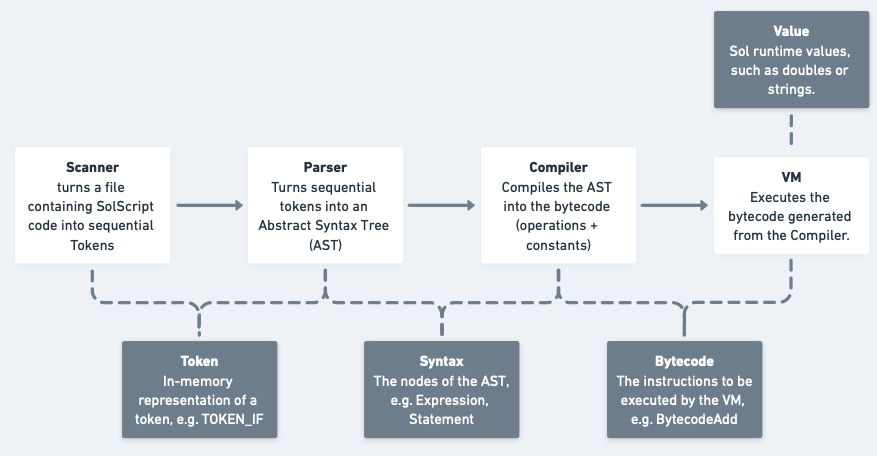

# SolScript

SolScript is an interpreted, stack-based, prototype-based, garbage-collected programming language.

**Important:** SolScript is a [work in progress](https://github.com/CaioCamatta/sol-script/tree/caiocamatta/pre-OSS-documentation-update?tab=readme-ov-file#v1.0-release-tracker).

To try SolScript, clone the repo, run `make`, and start a REPL via `./sol`. You can also execute `.sol` code via `./sol program.sol`.

## Example program
```
// Basic val declaration
val a = 1;

// Example object
var uniqueNumberGenerator = struct {
  currNumber: 0;

  // Print N new unique numbers and return the last unique one.
  printNewNumbers: (var count) => {
    while (count > 0){
      print count;
      this.currNumber = this.currNumber +1;
      count = count - 1;
    }
    this.currNumber; // In a block expression, no 'return' keyword is necessary
  };
}

// Print '0' and '1'.
uniqueNumberGenerator.printNewNumbers(2);
```

## Motivation

After finishing the book [Crafting Interpreters](https://craftinginterpreters.com/) and implementing the language Lox, I decided I wanted to create my own language. I had also just read [The C Programming Language](https://en.wikipedia.org/wiki/The_C_Programming_Language) and was motivated to work on another C project.


###  Inspiration

SolScript's lexical grammar is inspired by a number of languages
- C: the [C lexical grammar](https://learn.microsoft.com/en-us/cpp/c-language/lexical-grammar?view=msvc-170). 
- Scala: some of the [lexical grammar](https://www.scala-lang.org/files/archive/spec/2.12/01-lexical-syntax.html) and syntax, such as [block expressions](https://www.scala-lang.org/files/archive/spec/2.11/06-expressions.html#blocks), and functional aspects. 
- Python: some of the design decisions
- JavaScript: prototypes!
- Lox: SolScript's internals are similar to Lox's in many ways.

## Language Design

The following diagram gives a high-level overview of SolScript's internals.

SolScript has four main components: scanner, parser, compiler, and virtual machine. The scanner reads user code and outputs tokens. The parser consumes tokens and produces and abstract syntax tree (AST). The compiler traverses the AST and produces bytecode. The VM executes bytecode and keeps a stack of Values.



### Lexical Grammar

The scanner is a regular language that turns characters into tokens. For example, the "val" becomes "TOKEN_VAL".

The following is SolScript's lexical grammar. It's insipired by the [C lexical grammar](https://learn.microsoft.com/en-us/cpp/c-language/lexical-grammar?view=msvc-170), and [Scala lexical expressions](https://www.scala-lang.org/files/archive/spec/2.11/06-expressions.html#blocks).

```
token:
    keyword
    identifier
    number-literal
    string-literal
    punctuator

keyword:
    "number" 
    "if" 
    "else" 
    "struct" 
    "return" 
    "false" 
    "true" 
    "null"
    "val"
    "prototype"

number-literal:
    digit+ (. digit+)?

string-literal:
    " s-char-sequence* "

s-char-sequence:
    [^\"]

identifier: 
    non-digit (non-digit | digit)*

non-digit: one of
     _ a b c d e f g h i j k l m
     n o p q r s t u v w x y z
     A B C D E F G H I J K L M
     N O P Q R S T U V W X Y Z

digit: one of
    0 1 2 3 4 5 6 7 8 9

punctuator: one of
    ( ) { } . * + - ! % < > = <= >= == != || && ; ,
```

#### Example
For the statement `print 2+3-4;`, the scanner would parse the following tokens:
```
TOKEN_PRINT(lexeme="print", line=1, column=6)
TOKEN_NUMBER(lexeme="2", line=1, column=8)
TOKEN_PLUS(lexeme="+", line=1, column=9)
TOKEN_NUMBER(lexeme="3", line=1, column=10)
TOKEN_MINUS(lexeme="-", line=1, column=11)
TOKEN_NUMBER(lexeme="4", line=1, column=12)
TOKEN_SEMICOLON(lexeme=";", line=1, column=13)
TOKEN_EOF(lexeme="", line=2, column=2)
``````

### Syntactical Grammar

The syntactical grammar implemented by the Parser _should_ be parsable a look-ahead, left-to-right grammar with 1 token of look-ahead (aka LALR(1)). A program (`source`) is a series of `statement`s. Statements have side effects (or they aren't useful). `expression`s and `literal`s are the other two main "types". Expressions are evaluated to a value.

This grammar is primarily inspired by the [ANSI C grammar](https://slebok.github.io/zoo/c/c90/sdf/extracted/index.html#Statement) and Scala.

```
source: 
  statement* EOF

statement: 
  declaration
  block-statement
  iteration-statement
  selection-statement
  return-statement
  expression-statement
  assignment-statement
  print-statement

declaration:
  var-declaration
  val-declaration

var-declaration:
  "var" identifier ( "=" expression )?  ";"

val-declaration:
  "val" identifier "=" expression ";"

block-statement:
  "{" statement* "}" ";"
  block-expression

iteration-statement:
  "while" "(" expression ")" block-statement

selection-statement:
  "if" "(" expression ")" statement ( "else" statement )?

return-statement:
  "return" ( expression )? ";"
  
expression-statement:
  expression ";"

assignment-statement:
  postfix-expression "=" expression

print-statement:
  "print" expression ";"


expression:
  struct-expression
  function-expression
  block-expression
  logical-or-expression


struct-expression:
  "struct" "{" struct-declaration-list "}"

struct-declaration-list:
  struct-declaration
  struct-declaration-list "," struct-declaration
  
struct-declaration:
  identifier ":" expression
  "prototype" ":" identifier


function-expression:
  "(" (parameter-list)? ")" "=>" "{" statement "}"
  
parameter-list:
  identifier ( "," identifier )*

argument-list:
  expression ( "," expression )*


block-expression:
  "{" statement* expression "}"


logical-or-expression:
  logical-and-expression ( "or" logical-and-expression )*

logical-and-expression:
  equality-expression ( "and" equality-expression )*

equality-expression: 
  comparison-expression ( ("!=" | "==") comparison-expression) )*

comparison-expression:
  additive-expression ( ( ">" | ">=" | "<" | "<=" ) additive-expression )*

additive-expression:
  multiplicative-expression ( ( "-" | "+" ) multiplicative-expression )* 
  
multiplicative-expression:
  unary-expression ( ( "/" | "*" ) unary-expression )* 

unary-expression:
  ( "!"* | "-"* )? postfix-expression

postfix-expression:
  primary-expression
  postfix-expression "." identifier  

primary-expression:
  number-literal
  string-literal
  identifier
  ( expression )
  "true"
  "false"
  "null"
  "this"

call-expression:
  unary-expression
	

number-literal      # terminal
string-literal      # terminal
identifier-literal  # terminal
```

#### Example
For the statement `print 2+3-4;`, the scanner would parse the following Abstract Syntax Tree:

```
Source(numberOfStatements=1)
|   PrintStatement
|   |   AdditiveExpression(punctuator="-")
|   |   |   (left)
|   |   |   |   AdditiveExpression(punctuator="+")
|   |   |   |   |   (left)
|   |   |   |   |   |   PrimaryExpression
|   |   |   |   |   |   |   NumberLiteral(token="2")
|   |   |   |   |   (right)
|   |   |   |   |   |   PrimaryExpression
|   |   |   |   |   |   |   NumberLiteral(token="3")
|   |   |   (right)
|   |   |   |   PrimaryExpression
|   |   |   |   |   NumberLiteral(token="4")
```

### Compiled code

SolScript's compiled code is heavily inspired by [java `.class` files](https://en.wikipedia.org/wiki/Java_class_file). SolScript. It's has two parts:
- An array of bytecode
- A pool of constants

Bytecode may contains operands.

The pool of constants is necessary so the compiler can pass constants (such as strings for variable names) to the VM.

#### Example
For the statement `print 2+3-4;`, the compiler would produce the following constants and bytecode:
```
Constant Pool 
 #0 (double) 2.000000
 #1 (double) 3.000000
 #2 (double) 4.000000

Bytecode
 [ LOAD_CONSTANT #0 ]
 [ LOAD_CONSTANT #1 ]
 [ ADD ]
 [ LOAD_CONSTANT #2 ]
 [ PRINT ]
```

### The Virtual Machine

The SolScript Virtual Machine* is heaviliy inspired by the [Lox VM](https://craftinginterpreters.com/a-virtual-machine.html) and the [JVM](https://docs.oracle.com/javase/specs/jvms/se8/html/), and to some extend, the [CPython VM](https://leanpub.com/insidethepythonvirtualmachine/read). It transates 

*For those new to programming languages, a "virtual machine" here is not the same as a "Windows virtual machine". A programming language VM translates bytecode down to low-level code or machine code. 

Instruction Set (work-in-progress):
```
OP_LOAD_CONSTANT,  // load a constant from the compiled constant pool onto the stack
OP_SET_VAL,        // set local variable; expects an identifier at the top of the stack, and a value right below it
OP_GET_VAL,        // read local variable; expects an identifier at the top of the stack
OP_TRUE,           // put Value true on the stack
OP_FALSE,          // put Value false on the stack
OP_ADD,            // add two numbers at the top of the stack, replace them with the result Value
OP_PRINT           // print value at the top of the stack
```

A runtime `Value` could be a number, string, object, etc.

## Development

### Philosophy

SolScript is a "toy" programming language. Its main advantage over "real" languages, if any, its simplicity and the ease with which one can learn its internals. Learning this codebase should be exceptionally easy. Hence, comments and documentation should be extensive.

Additionally, run time performance is more critical than compilation time performance. Inneficiencies in the scanner, parser, and compiler are acceptable.

### Project structure

`src/` - `.c` and `.h` source files

`src/util/` - `.c` and `.h` utility files

`test/unit/src/` - unit tests for the C code

`test/unit/src/util/` - unit tests for the utilities C code

`test/sol/` - tests written in SolScript


## v1.0 Release Tracker

The following features are necessary a proper v1.0 release, in rough order:

 - [x] Design the lexical grammar
 - [x] Design the syntax grammar
 - [x] Add build configuration using make
 - [x] Add unit testing framework ([MinUnit](https://jera.com/techinfo/jtns/jtn002))
 - [x] Add REPL / interactive shell
 - [x] Implement and test hash table utility
 - [x] Implement and test array utility
 - [X] Implement robust debugging module for all parts of the system.
 - [x] Implement full scanner for the lexical grammar
 - [x] Implement minimal parser, compiler, and VM for end-to-end test.
 - [x] Add constant pool (similar to [Java's](https://blogs.oracle.com/javamagazine/post/java-class-file-constant-pool))
 - [X] Add support for variable declaration and access
 - [X] Implement print statements
 - [X] Implement additive expression
 - [ ] Implement all other "simple" expressions, i.e. excluding call-expressions
 - [ ] Implement selection statement (`if`s)
 - [ ] Implement the rest of the parser for the whole syntax grammar
 - [ ] Add conditional debugging/logging for tests that fail
 - [ ] Implement functions and returns
 - [ ] Implement assignment statements
 - [ ] Add CLI argument to enable or disable debugging logs in the REPL.
 - [ ] Improve error logs; print line and column
 - [ ] Implement block statements and expressions
 - [ ] Implement iteration statement (loops)
 - [ ] Add Panic Mode error recovery; stop crashing the compiler on every error.
 - [ ] Implement objects / structs
 - [ ] Add garbage collector
 - [ ] Implement closures
 - [ ] (maybe) Add native functions
 - [ ] (maybe) Add benchmark tests
 - [ ] (maybe) Profile execution and find opportunities for optimization
 - [ ] (maybe) Implement [NaN boxing](https://piotrduperas.com/posts/nan-boxing)
